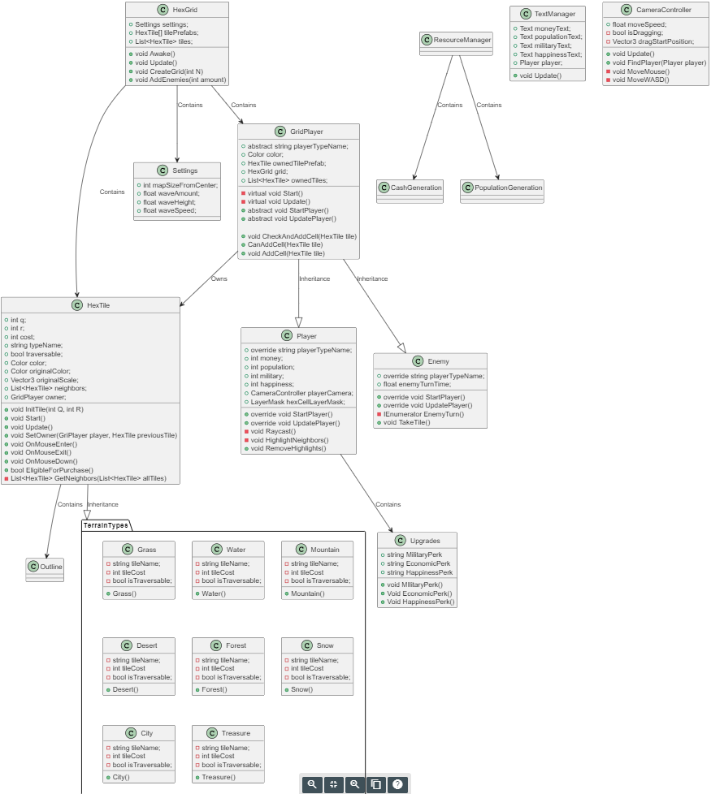
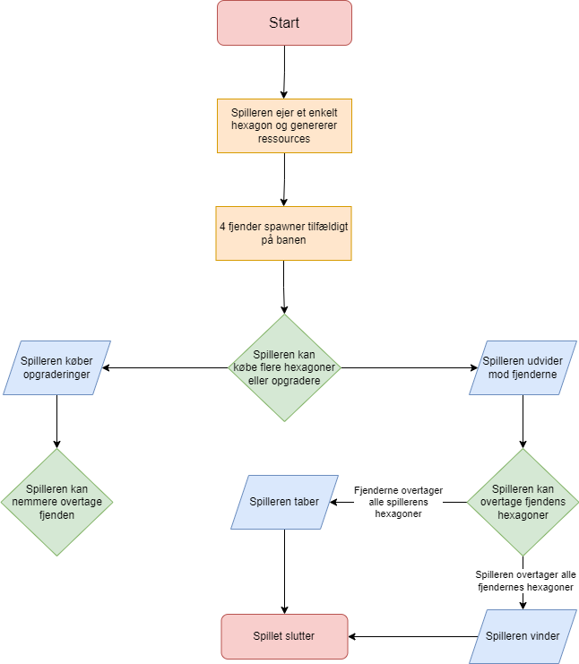

# Exam-Game
This is a small game made for our programming class.
 
A combination of the idle genre with strategic elements using Hexagons.

### Environment:
> **Map Description:** A set sized map, consisting of hexagonal tiles. Player starts by owning one tile ../

> **Tiles:**
> * Forest
> * Grass
> * Ice
> * Snow
> * Sand
> * Mountain
> * Water
> * Village
> * Treasure
> 
> Tiles are hexagonal

### Player: 

> The player spawns a random place on the map and can zoom + look around, while expanding to neighbor tiles.
 
> **Movement:** Player is able to move by buying tiles adjacent to already owned tiles using cash.

> **City Management:** By clicking on owned tiles, purchaseable upgrades and perks are shown, as well as game stats.

> **Interactions:** Upgrades can be bought if the player has enough cash. The player can move by expanding into normal or enemy tiles, by interacting with said tiles.

> **Upgrades:** Upgrades are used for updating stats, both positive and negative  
 
### Enemy:

> Different enemy bases spawn around player base. Difficulty relative to enemy bases beaten. Enemy tiles have a red outline. They do not contain Population, Cash, Military or Happiness like the player.  

> **Movement:** Enemies move to an adjacent tile, towards the player, after a set amount of time in relation to their difficulty. Easier enemies move slowly in a straight line, while harder move faster in formation.

> **Interacting:** The player may interact with the enemy tiles by clicking and seeing a timer for their next move. The player can also expand into an enemy tile if they have enough military.

### Time:

> Different values are generated over time, e.g. every game tick.

> **Population:** Generated for the player, depending on amount of tiles, happiness and upgrades.  
> Population is used to expand military. If population reaches 0, you lose.  
> High population (relative to amount of tiles) = More money, less happiness  
> Low population (relative to amount of tiles) =  Less money, more happiness

> **Cash:** Generated by owned tiles over time, depending on number of tiles, upgrades and happiness.  
> Cash is used for upgrades, perks and buying adjacent tiles to expand.

> **Military:** Slowly generated, depending on population with max amount
> Military is used to expand into enemy tiles. Pay military instead of cash.

> **Happiness:** Happiness is a set percentage, depending on choices and different upgrades bought.  
> High happiness = Less cash, more population, cheaper enemy tiles  
> Low happiness = More cash, less population, more expensive enemy tiles

### Victory:

> If the player removes every enemy tile, they win.  
> The player loses if enemies overtake all player tiles, or player loses all population

# MuSCoW
## Must
> **Environment**  
> An entire world map created for the player to see  
> Must have at least grass tiles. 

> **Player**  
> Must be able to generate cash and buy adjacent tiles  
> Must be able to look around map

> **Enemy**  
> Must be able to expand territory

## Should
> **Environment**  
> Should have multiple tiles
>
> **Player**  
> Should have multiple available upgrades  
> Should be able to see tile information
>
> **Enemy**  
> Should expand towards player  
> Should be balanced

## Could
> **Environment**  
> Could have biomes and landscape  
> Could change size based on difficulty

## Would
> **Environment**  
> Would be nice to have fog of war  
> Woudl want to have colored outlines for tile borders

> **Game**  
> Would want it to be completely balanced

# Class Diagram - PUML
> Not updated... Very old  

# Flow Diagram
